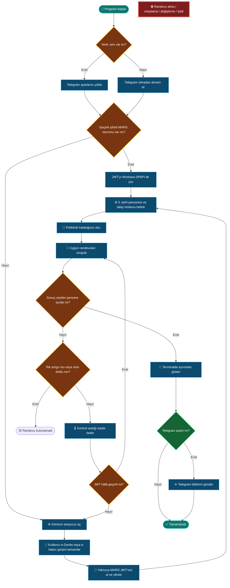

> [!CAUTION]
> ### ⚖️ Yasal ve kullanım uyarısı
>
> Bu proje **Sağlık Bakanlığı, MHRS, e-Devlet veya e-Nabız tarafından
> geliştirilmemiş, onaylanmamış ya da desteklenmemiş bağımsız bir açık kaynak
> çalışmasıdır.** Resmî bir MHRS istemcisi değildir.
>
> - Yazılım yalnızca kullanıcının kendi hesabındaki uygun randevuları sorgulamak
>   ve bildirmek amacıyla hazırlanmıştır. **Randevu oluşturmaz, onaylamaz,
>   değiştirmez veya iptal etmez.** CAPTCHA, SMS doğrulaması, erişim kontrolü ya
>   da oran sınırlaması aşmaya çalışmaz.
> - Uygulamayı yalnızca erişim yetkiniz bulunan kendi hesabınızla kullanın. Başka
>   kişilere ait hesap, oturum veya sağlık verilerini izinsiz kullanmayın.
> - Kullanıcı; yürürlükteki mevzuata, MHRS kullanım koşullarına ve ilgili
>   hizmetlerin kurallarına uyulmasından kendisi sorumludur. Servisi gereksiz
>   yükleyecek kadar kısa sorgu aralıkları veya çok sayıda eş zamanlı istemci
>   kullanmayın.
> - Proje, MHRS'nin belgelenmemiş web servislerini yalnızca okuma amacıyla
>   kullanır. Bu servisler önceden bildirim yapılmadan değişebilir, erişimi
>   kısıtlayabilir veya tamamen kapanabilir. Yazılımın kesintisiz ya da hatasız
>   çalışacağı garanti edilmez.
> - Telegram bildirimi etkinleştirildiğinde hastane, poliklinik, hekim ve randevu
>   zamanı gibi sağlıkla ilişkili bilgiler Telegram altyapısına gönderilir. Bu
>   aktarımı kabul etmiyorsanız Telegram özelliğini etkinleştirmeyin.
> - Yazılım **olduğu gibi** sunulur. Yürürlükteki hukukun izin verdiği ölçüde;
>   kullanım, hesap kısıtlaması, veri kaybı, hizmet kesintisi veya diğer doğrudan
>   ya da dolaylı sonuçlardan kullanıcı sorumludur. Bu metin hukuki danışmanlık
>   değildir; tereddüt halinde uzman görüşü alın.

<div align="center">

# 🏥 MHRS Randevu Botu

**MHRS parolası istemeden; görünür tarayıcıda e-Devlet veya e-Nabız girişiyle
uygun randevuları takip eden, terminal ve Telegram üzerinden bildiren Go
uygulaması.**


`Randevu ara` · `Konsolda bildir` · `Telegram'a gönder` · `Asla randevu alma`

</div>

---

## 📚 İçindekiler

- [Proje ne yapar?](#-proje-ne-yapar)
- [Parola istemeden nasıl giriş yapıyor?](#-parola-istemeden-nasıl-giriş-yapıyor)
- [Özellikler](#-özellikler)
- [Gereksinimler](#-gereksinimler)
- [Kurulum](#-kurulum)
- [Kullanım](#-kullanım)
- [Telegram bildirimi](#-telegram-bildirimi)
- [Oturum ve tarayıcı yönetimi](#-oturum-ve-tarayıcı-yönetimi)
- [Komut satırı seçenekleri](#-komut-satırı-seçenekleri)
- [Güvenlik ve gizlilik](#-güvenlik-ve-gizlilik)
- [Geliştirme](#-geliştirme)
- [Çalışma akışı](#-çalışma-akışı)
- [Lisans](#-lisans)

## 🎯 Proje ne yapar?

MHRS Randevu Botu, kullanıcının belirlediği il ve poliklinik için uygun
randevuları belirli aralıklarla sorgular. Seçilen tarih penceresine düşen bir
randevu bulunduğunda sonucu renkli terminal çıktısıyla gösterir ve isteğe bağlı
olarak Telegram mesajı gönderir.

> [!IMPORTANT]
> Uygulamanın son noktası **bildirimdir**. Randevu alma, onaylama, değiştirme veya
> iptal etme işlemleri hem kodda hem proje kapsamında bilinçli olarak yoktur.

| 🔎 Sorgulama | 🔐 Oturum | 🔔 Bildirim | 🚫 Sınır |
| :---: | :---: | :---: | :---: |
| 1–16 günlük pencere | Windows DPAPI | Terminal + Telegram | Randevu almaz |
| Tek veya sürekli kontrol | Manuel e-Devlet/e-Nabız girişi | Türkiye saati | Doğrulama aşmaz |

## 🔑 Parola istemeden nasıl giriş yapıyor?

Proje, MHRS'nin e-Devlet ve e-Nabız üzerinden sunduğu oturum açma akışını
kullanır. Kullanıcıdan MHRS, e-Devlet veya e-Nabız parolası istemek yerine girişi
görünür tarayıcıda tamamen kullanıcıya bırakır.

| Adım | Ne olur? | Uygulamanın okumadığı veri |
|---:|---|---|
| **1** | Uygulama görünür Chromium/Chrome/Edge penceresini ayrı ve geçici bir profille açar. | Mevcut tarayıcı geçmişiniz ve normal profiliniz |
| **2** | e-Devlet veya e-Nabız seçimini yapar, resmî giriş ekranındaki alanları kendiniz doldurursunuz. | T.C. kimlik numarası, parola, SMS kodu ve form alanları |
| **3** | Giriş tamamlanıp tarayıcı MHRS alan adına döndüğünde uygulama yalnızca MHRS'nin oluşturduğu oturum JWT'sini okur. | e-Devlet/e-Nabız oturumu ve parolası |
| **4** | JWT doğrulanır, tarayıcı kapanır ve token Windows DPAPI ile şifrelenerek sonraki çalıştırma için saklanır. | Düz metin JWT veya merkezi bir sunucu kaydı |

> [!NOTE]
> Uygulama giriş ekranlarını otomatik doldurmaz ve tuş vuruşlarını dinlemez.
> Yalnızca tarayıcı yeniden `mhrs.gov.tr` alanına döndükten sonra MHRS'ye ait
> cookie/localStorage içindeki oturum tokenını kontrol eder. JWT hassas bir
> kimlik doğrulama verisidir; bu nedenle hiçbir zaman repoya veya loglara
> yazılmaz.

Bu yöntem sayesinde kullanıcının parolası uygulamaya teslim edilmez. Kayıtlı
MHRS oturumu geçerli olduğu sürece sonraki çalıştırmalarda tarayıcı açılmaz;
oturum sona erdiğinde kullanıcıdan aynı manuel giriş tekrar istenir.

## ✨ Özellikler

- 🧭 Parametresiz çalıştırmada adım adım etkileşimli kurulum
- 🌐 Görünür Chromium, Chrome veya Edge penceresinde manuel giriş
- 🔒 MHRS JWT'sini Windows kullanıcı hesabına bağlı DPAPI şifrelemesiyle saklama
- 🏥 Güncel poliklinik listesini getirip metinle arama
- 📅 Başlangıç anına göre sabit, **1–16 günlük** randevu penceresi
- 🔁 Tek sorgu veya süre dolana kadar periyodik takip
- 🕒 Türkçe ay adları ve `TSİ` ekiyle okunabilir tarih/saat
- 🎨 Etkileşimli terminalde renkli durum ve kullanıcı girdisi gösterimi
- 🔔 Randevu bulunduğunda terminal zili ve ayrıntılı konsol çıktısı
- ✈️ İsteğe bağlı Telegram bildirimi ve bağımsız test komutu
- 🧹 Süresi dolan oturumu temizleyip gerektiğinde manuel girişi yeniden açma
- 🛡️ CAPTCHA, SMS doğrulaması veya oran sınırı aşmayan dar kapsam

## 🧰 Gereksinimler

| Gereksinim | Sürüm / seçenek |
|---|---|
| İşletim sistemi | Windows 10 veya Windows 11 |
| Go | 1.26 veya üzeri |
| Tarayıcı | Chromium, Google Chrome veya Microsoft Edge |
| Telegram | Yalnızca Telegram bildirimi kullanılacaksa |

## 🚀 Kurulum

PowerShell açın ve projeyi klonlayın:

```powershell
git clone https://github.com/berkeserce/mhrs-randevu-botu.git
cd mhrs-randevu-botu
go mod download
```

Kurulumun doğru olduğunu kontrol etmek için:

```powershell
go test ./...
```

> [!TIP]
> Telegram kullanmayacaksanız `.env` oluşturmanız gerekmez. Uygulama yalnızca
> konsol bildirimiyle eksiksiz çalışır.

## 💻 Kullanım

### Etkileşimli kullanım — önerilen

Parametre vermeden başlatın:

```powershell
go run ./cmd/mhrs-randevu-botu
```

Uygulama sırasıyla şunları sorar:

1. İl plaka kodu (`1–81`)
2. Kaç gün içindeki randevuların aranacağı (`1–16`, varsayılan `3`)
3. Tek sorgu veya sürekli takip seçimi
4. Sürekli takipte kontrol aralığı (varsayılan `5 dakika`)
5. Aranacak poliklinik ve listeden seçim

İlk çalıştırmada görünür bir tarayıcı açılır. e-Devlet veya e-Nabız girişini
tarayıcıda **kendiniz** tamamladıktan sonra uygulama MHRS'ye dönüldüğünü algılar,
yalnızca MHRS JWT'sini alır ve tarayıcıyı kapatır.

### Parametrelerle kullanım

Tek sorguyla hızlı kontrol:

```powershell
go run ./cmd/mhrs-randevu-botu -once -il 34
```

Önümüzdeki 5 günü, 10 dakikada bir takip etme:

```powershell
go run ./cmd/mhrs-randevu-botu -il 34 -gun 5 -interval 10m
```

Bilinen poliklinik ID'siyle seçim adımını geçme:

```powershell
go run ./cmd/mhrs-randevu-botu -il 34 -klinik 136 -gun 3
```

> [!NOTE]
> Randevu penceresi programın başladığı anda sabitlenir. Örneğin `-gun 5`, takip
> devam ederken ileri kayan bir pencere oluşturmaz; başlangıç anından sonraki ilk
> 5 günü kapsar. Pencerenin dışındaki sonuçlar bildirilmez.

### Takip davranışı

- Varsayılan pencere `3 gün`, kontrol aralığı `5 dakika`dır.
- Sürekli takipte bir dakikadan kısa aralıklara izin verilmez.
- Uygun randevu bulunursa ayrıntılar yazılır, bildirim gönderilir ve program
  başarıyla kapanır.
- Pencere dolarsa “randevu bulunamadı” sonucu gösterilir ve program kapanır.
- Takip sırasında JWT biterse pencere iptal edilmez; manuel giriş yeniden açılır.
- Programı istediğiniz anda `Ctrl+C` ile güvenli biçimde durdurabilirsiniz.

### Terminal renkleri ve Türkiye saati

Tarihler `10 Ağustos 2026 17:13:59 TSİ` biçiminde gösterilir. ANSI renkleri
yalnızca etkileşimli terminalde kullanılır; dosyaya veya pipe'a yönlendirilen
çıktıya renk kodu yazılmaz.

Renkleri kapatmak için:

```powershell
go run ./cmd/mhrs-randevu-botu -no-color
```

Standart `NO_COLOR` ortam değişkeni de desteklenir.

## ✈️ Telegram bildirimi

Telegram tamamen isteğe bağlıdır. Ayarlar, Git tarafından yok sayılan yerel
`.env` dosyasından otomatik okunur.

### 1. Bot oluşturun

Telegram'da resmî `@BotFather` hesabına `/newbot` gönderin ve verilen bot tokenını
güvenli bir yerde tutun. Ardından oluşturduğunuz botun sohbetini açıp `/start`
gönderin.

### 2. Ortam dosyasını hazırlayın

```powershell
Copy-Item .env.example .env
```

`.env` dosyasına yalnızca tokenı yazın:

```dotenv
TELEGRAM_BOT_TOKEN=BOTFATHER_TOKENI_BURAYA
TELEGRAM_CHAT_ID=
```

### 3. Chat ID'yi bulun

```powershell
go run ./cmd/mhrs-randevu-botu -telegram-chat-id
```

Gösterilen sayıyı `.env` içindeki `TELEGRAM_CHAT_ID` alanına ekleyin:

```dotenv
TELEGRAM_BOT_TOKEN=BOTFATHER_TOKENI_BURAYA
TELEGRAM_CHAT_ID=123456789
```

### 4. Bildirimi test edin

```powershell
go run ./cmd/mhrs-randevu-botu -telegram-test
```

Başarılı sonuç:

```text
Yerel .env ayarlari yuklendi.
Telegram test bildirimi gonderildi.
```

> [!WARNING]
> `.env` düz metin bir yerel dosyadır. Bot tokenını parola gibi koruyun; ekran
> görüntüsünde, issue'da, logda veya commit'te paylaşmayın. `.gitignore` dosyası
> `.env` ve `.env.*` dosyalarını dışlar; yalnızca boş `.env.example` publictir.

Telegram etkinse randevu bulunduğunda en fazla ilk beş seçeneğin hastane,
poliklinik, hekim, muayene yeri ve zaman bilgisi gönderilir. Telegram isteği
başarısız olsa bile konsol sonucu korunur. İşletim sistemi ortam değişkenleri
ayarlanmışsa `.env` içindeki aynı adlı değerlerden önceliklidir.

## 🔐 Oturum ve tarayıcı yönetimi

### JWT saklama

MHRS JWT'si `.env` içinde veya düz metin olarak tutulmaz. Windows kullanıcısına
bağlı DPAPI şifrelemesiyle aşağıdaki konuma kaydedilir:

```text
%LocalAppData%\mhrs-randevu-botu\session.bin
```

Bu dosya başka bir Windows kullanıcısı veya normalde başka bir bilgisayar
tarafından çözülemez. Token geçersizleştiğinde kayıt silinir ve manuel giriş
yeniden açılır.

Yeni oturumu zorlamak:

```powershell
go run ./cmd/mhrs-randevu-botu -once -il 34 -refresh-session
```

Kayıtlı oturumu silmek:

```powershell
go run ./cmd/mhrs-randevu-botu -clear-session
```

### Tarayıcı seçimi

Uygulama aşağıdaki tarayıcıları standart Windows kurulum konumlarında ve
`PATH` içinde arar:

1. Chromium
2. Google Chrome
3. Microsoft Edge

Otomatik algılama başarısızsa yolu elle verin:

```powershell
go run ./cmd/mhrs-randevu-botu -once -il 34 -chromium-path "C:\Program Files\Chromium\Application\chrome.exe"
```

Tarayıcı girişi için geçici ve ayrı bir profil açılır. Giriş tamamlandığında
profil silinir; uygulama e-Devlet/e-Nabız kullanıcı adı, parola, SMS kodu veya
form alanlarını okumaz.

## 🧩 Komut satırı seçenekleri

<details>
<summary><strong>Tüm seçenekleri göster</strong></summary>

| Seçenek | Varsayılan | Açıklama |
|---|---:|---|
| `-il` | `-1` | İl plaka kodu / MHRS il ID |
| `-ilce` | `-1` | İlçe ID; `-1` tümü |
| `-klinik` | `-1` | Poliklinik ID; verilmezse etkileşimli seçim |
| `-kurum` | `-1` | Hastane/kurum ID; `-1` tümü |
| `-hekim` | `-1` | Hekim ID; `-1` tümü |
| `-muayene-yeri` | `-1` | Muayene yeri ID; `-1` tümü |
| `-cinsiyet` | `F` | MHRS cinsiyet filtresi: `F` veya `M` |
| `-gun` | `3` | Randevu tarihi ve takip süresi: `1–16` gün |
| `-interval` | `5m` | Sürekli takipte kontrol aralığı; en az `1m` |
| `-once` | kapalı | Yalnızca bir sorgu yapar |
| `-browser-timeout` | `10m` | Manuel tarayıcı girişi zaman aşımı |
| `-chromium-path` | otomatik | Tarayıcı çalıştırılabilir dosyasının yolu |
| `-refresh-session` | kapalı | Kayıtlı JWT yerine yeni manuel giriş açar |
| `-clear-session` | kapalı | Şifreli oturum kaydını siler ve çıkar |
| `-telegram-chat-id` | kapalı | Bota mesaj atan chat ID'lerini gösterir |
| `-telegram-test` | kapalı | Test bildirimi gönderir ve çıkar |
| `-no-color` | kapalı | Terminal renklerini kapatır |

Güncel listeyi terminalden görmek için:

```powershell
go run ./cmd/mhrs-randevu-botu -help
```

</details>

## 🛡️ Güvenlik ve gizlilik

| Veri / işlem | Davranış |
|---|---|
| e-Devlet/e-Nabız parolası | Uygulama tarafından okunmaz veya saklanmaz |
| T.C. kimlik / telefon / SMS | Uygulama tarafından istenmez |
| MHRS JWT | Windows DPAPI ile şifrelenir |
| Telegram bot tokenı | Yerel `.env` dosyasından okunur, loglanmaz |
| Randevu bilgileri | Konsolda; Telegram açıksa Telegram'da gösterilir |
| Tarayıcı profili | Geçici oluşturulur, girişten sonra silinir |
| MHRS işlemleri | Poliklinik kataloğu ve uygunluk sorgusuyla sınırlıdır |

> [!TIP]
> Public issue veya hata raporu paylaşırken T.C. kimlik numarası, telefon, JWT,
> bot tokenı, chat ID, hastane/hekim bilgisi ve terminal ekran görüntülerini
> mutlaka temizleyin.

### Kesinlikle commit etmeyin

```text
.env
.env.local
session.bin
JWT veya token içeren çıktılar
Kişisel randevu ekran görüntüleri
```

## 🚧 Proje kapsamı

### Kapsam içinde

- Poliklinik kataloğunu okuma
- Uygun randevu sorgulama
- Tarih penceresine göre sonuç filtreleme
- Konsol ve Telegram bildirimi
- Kullanıcının yaptığı manuel girişten MHRS oturumunu alma

### Kapsam dışında

- Randevu oluşturma, onaylama, değiştirme veya iptal etme
- CAPTCHA, SMS, hız sınırı ya da erişim kontrolü aşma
- Kullanıcı parolası toplama veya otomatik giriş formu doldurma
- Çoklu hesap yönetimi veya merkezi kullanıcı verisi toplama
- Üçüncü kişilerin hesabını izleme

Bu güvenlik sınırlarını değiştiren katkılar kabul edilmez.

## 🧪 Geliştirme

Değişiklik göndermeden önce:

```powershell
go fmt ./...
go vet ./...
go test -race ./...
go build -o .cache\mhrs-randevu-botu.exe ./cmd/mhrs-randevu-botu
```

MHRS ve Telegram ağ istemcilerinin birim testleri yerel HTTP test sunucularıyla
çalışır; gerçek hesap, gerçek MHRS oturumu veya gerçek Telegram botu kullanmaz.

<details>
<summary><strong>Proje dizinlerini göster</strong></summary>

```text
mhrs-randevu-botu/
├── cmd/mhrs-randevu-botu/   # CLI, etkileşimli akış ve terminal çıktısı
├── internal/browserauth/    # Görünür tarayıcı girişi ve JWT yakalama
├── internal/envfile/        # Yerel .env dosyası yükleyicisi
├── internal/mhrs/           # Salt-okunur MHRS istemcisi
├── internal/sessioncache/   # DPAPI şifreli oturum önbelleği
├── internal/telegramnotify/ # Telegram Bot API bildirim istemcisi
├── .env.example             # Secretsiz yapılandırma örneği
├── go.mod
├── LICENSE
└── README.md
```

</details>

## 🌳 Çalışma akışı



> [!NOTE]
> Kırmızı düğüm bir işlem adımı değildir; projenin bilinçli güvenlik sınırını
> gösterir. Uygulama bu işlemler için herhangi bir istek göndermez.

## 📄 Lisans

Bu proje [MIT Lisansı](LICENSE) ile yayımlanır. Lisans, yukarıdaki yasal ve
etik kullanım sorumluluklarını ortadan kaldırmaz.
